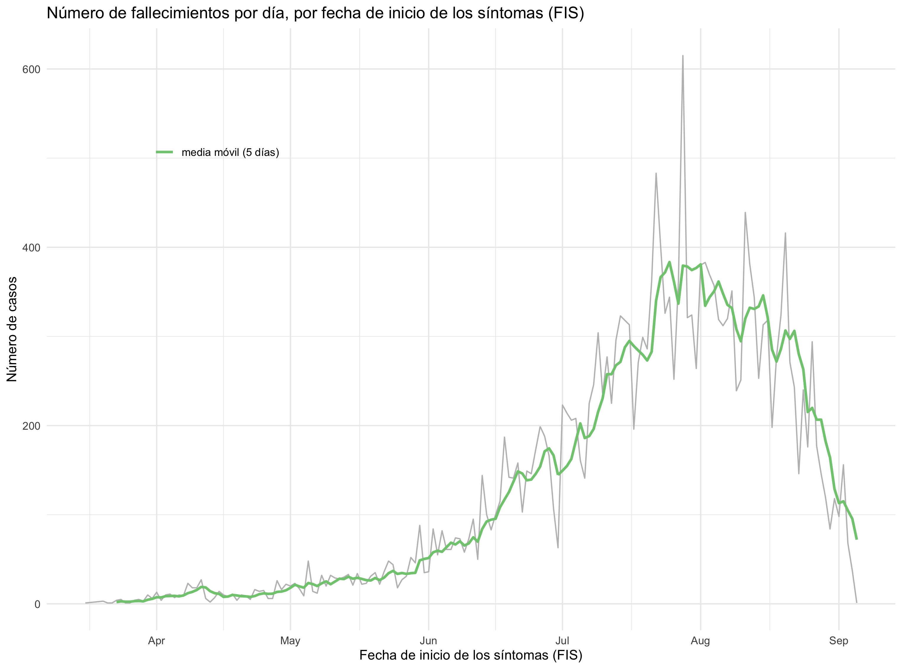
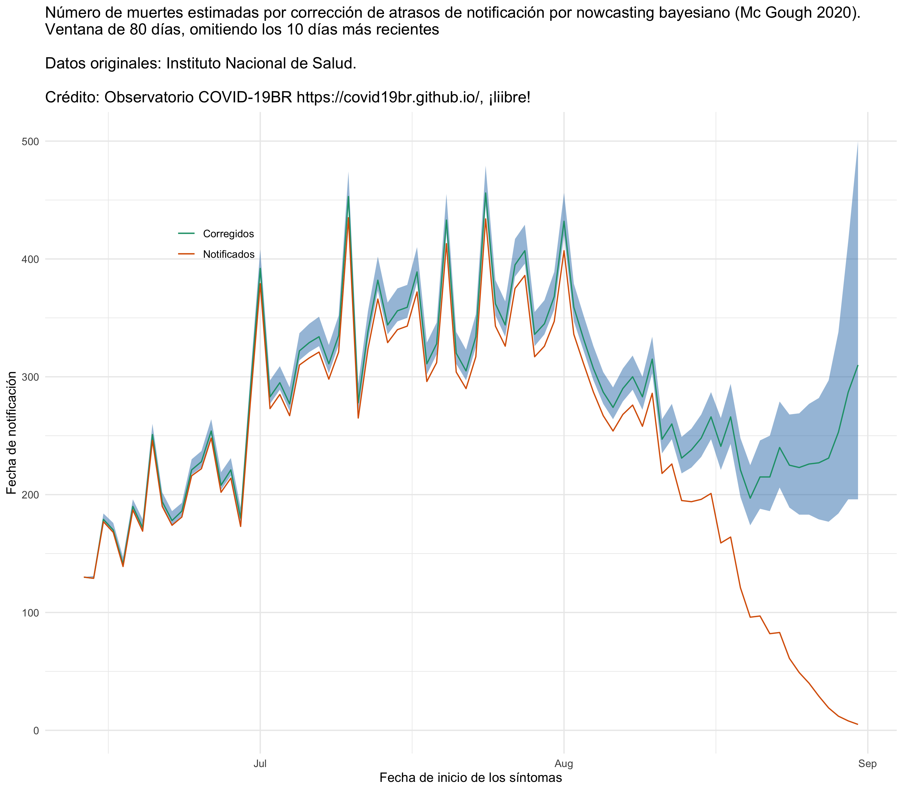

<!-- README.md is generated from README.Rmd. Please edit that file -->

```{r, include = FALSE}
knitr::opts_chunk$set(
  collapse = TRUE,
  comment = "#>",
  echo = FALSE
)
```


<!-- badges: start -->
<!-- badges: end -->

```{r remedy001, message=FALSE, echo=FALSE, warning=F}


fecha <- vroom::vroom("./data/Casos_positivos_de_COVID-19_en_Colombia.csv", col_select = "fecha reporte web")
f <- max(unique(fecha$`fecha reporte web`))

```

# Datos de COVID-19 para Colombia por departamentos y municipios hasta `r format(f, "%d/%m/%Y")`

```{r, echo = FALSE, eval = TRUE, out.width = 350}
knitr::include_graphics("./figs/deptos.png")
knitr::include_graphics("./figs/mpos.png")
```

# Número de casos y fallecimientos diarios, por fecha de inicio de los síntomas

```{r, echo = FALSE, eval = TRUE, out.width= 600}
knitr::include_graphics("./figs/casos_diarios.png")

```


# Corrección de atrasos por _nowcasting_ bayesiano (Mc Gough _et al_ 2020)

Para saber más sobre el análisis de corrección de atrasos de notificación por _nowcasting_ bayesiano, visite la página del __Observatório COVID19-BR__ [https://covid19br.github.io](https://covid19.br.github.io), grupo independiente de investigadores de diversas universidades de Brasil y del mundo, que realiza análisis relativos al estado de la pandemia en Brasil. 


```{r, echo = FALSE, eval = TRUE, out.width= 600}
knitr::include_graphics("./figs/Nowcasting.png")

```

# Referencia

McGough, S. F. et al. (2020) ‘Nowcasting by Bayesian Smoothing: A flexible, generalizable model for real-time epidemic tracking’, PLOS Computational Biology, 16(4), p. e1007735. doi: 10.1371/journal.pcbi.1007735. [https://journals.plos.org/ploscompbiol/article?id=10.1371/journal.pcbi.1007735](https://journals.plos.org/ploscompbiol/article?id=10.1371/journal.pcbi.1007735)
