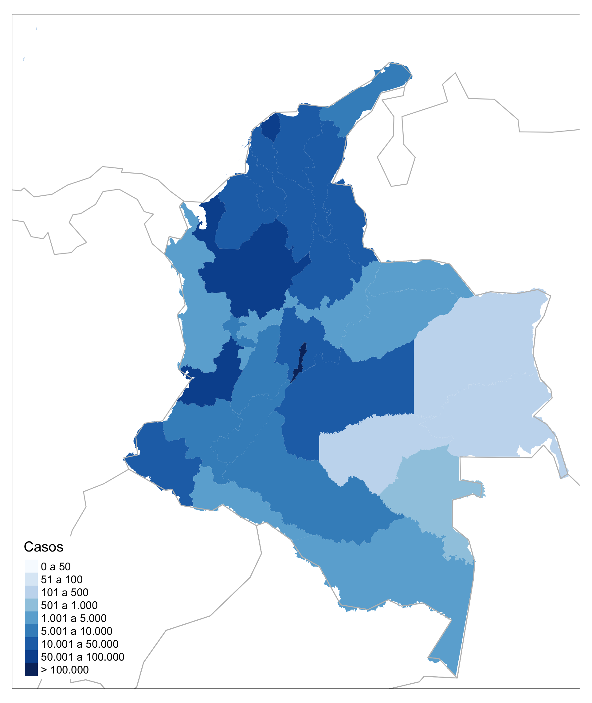
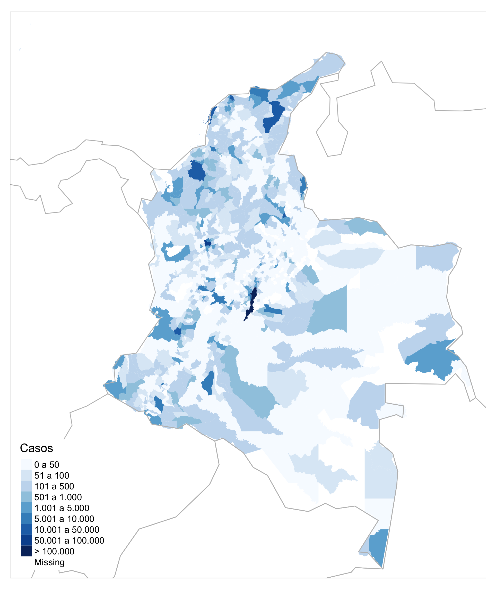

<!-- README.md is generated from README.Rmd. Please edit that file -->

```{r, include = FALSE}
knitr::opts_chunk$set(
  collapse = TRUE,
  comment = "#>",
  echo = FALSE
)
```


<!-- badges: start -->
<!-- badges: end -->

```{r remedy001, message=FALSE, echo=FALSE, warning=F}


fecha <- vroom::vroom("./data/Casos_positivos_de_COVID-19_en_Colombia.csv", col_select = "fecha reporte web")
f <- max(unique(fecha$`fecha reporte web`))

```

# Datos de COVID-19 para Colombia por departamentos y municipios hasta `r format(f, "%d/%m/%Y")`

```{r, echo = FALSE, eval = TRUE, out.width = 350}


```

# Corrección de atrasos por _nowcasting_ bayesiano

Para saber más sobre el análisis de corrección de atrasos de notificación por _nowcasting_ bayesiano, visite la página del __Observatório COVID19-BR__ [https://covid19br.github.io](https://covid19.br.github.io), grupo independiente de investigadores de diversas universidades de Brasil y del mundo, que realiza análisis relativos al estado de la pandemia en Brasil. 


```{r, echo = FALSE, eval = TRUE, out.width= 700}
knitr::include_graphics("./figs/Nowcasting.png")
```

