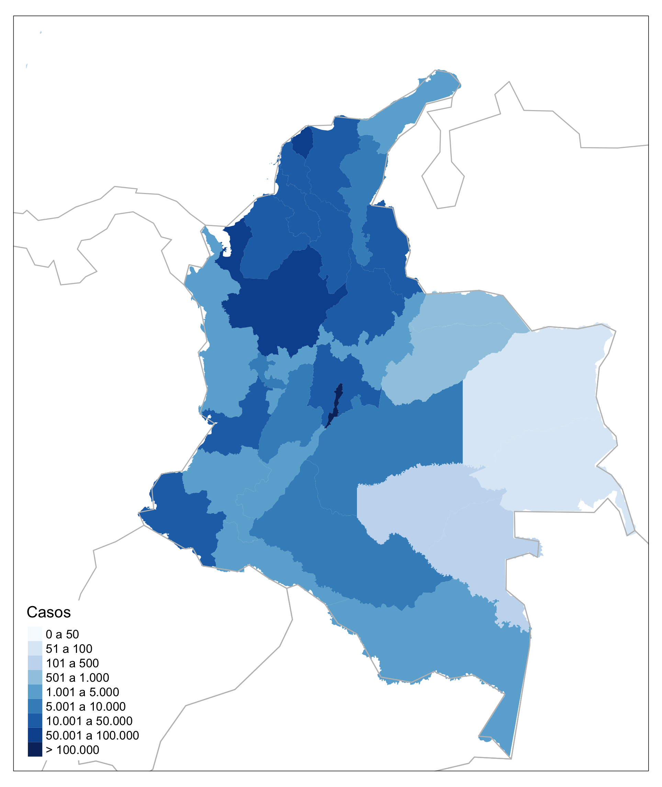
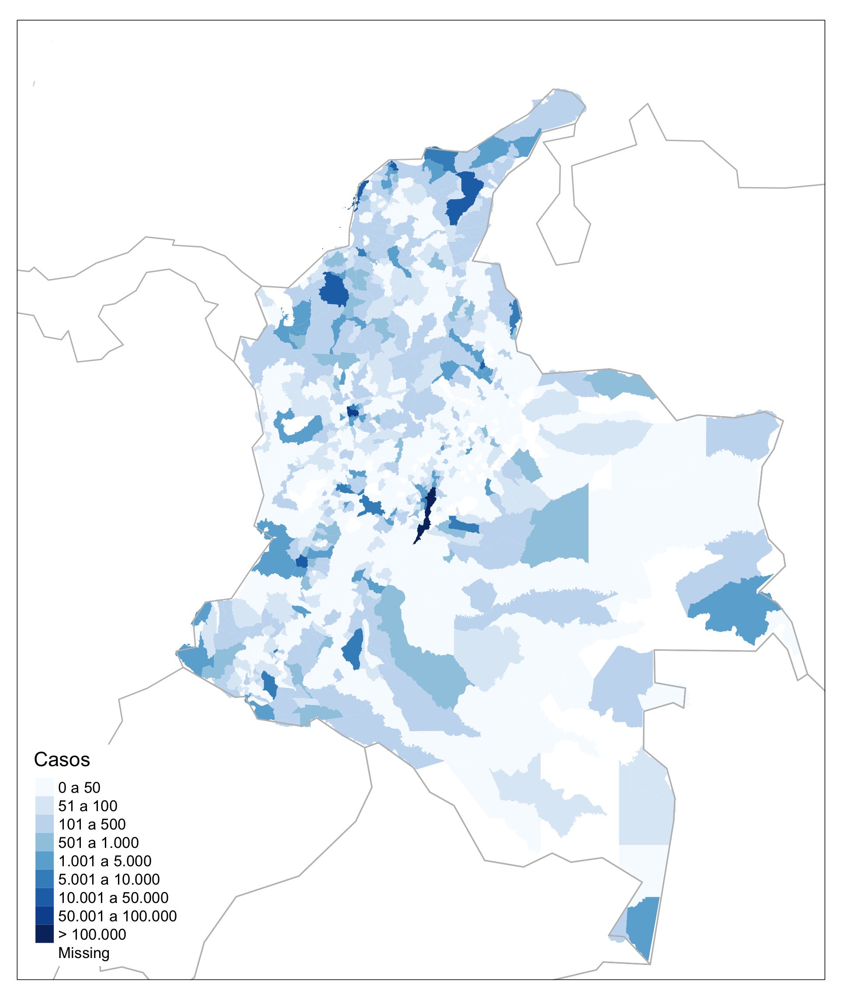
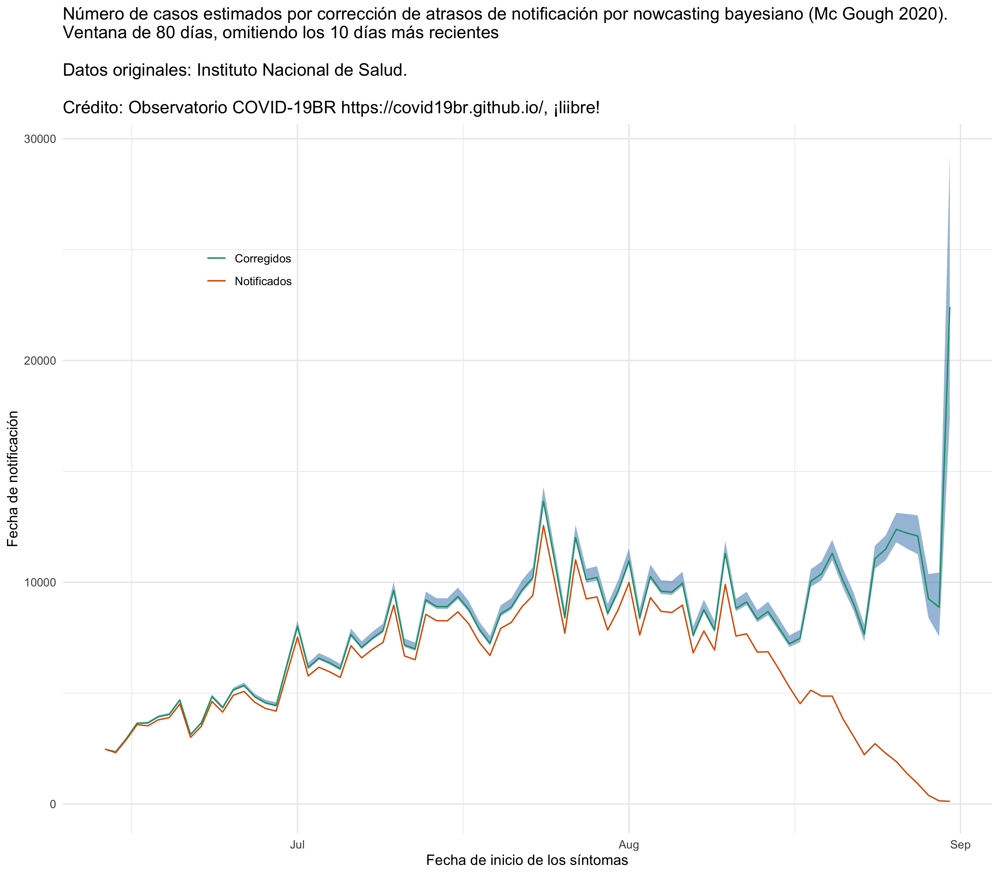

<!-- README.md is generated from README.Rmd. Please edit that file -->

<!-- badges: start -->

<!-- badges: end -->

# Datos de COVID-19 para Colombia por departamentos y municipios hasta 29/08/2020

# Corrección de atrasos por *nowcasting* bayesiano

Para saber más sobre el análisis de corrección de atrasos de
notificación por *nowcasting* bayesiano, visite la página del
**Observatório COVID19-BR**
[https://covid19br.github.io](https://covid19.br.github.io), grupo
independiente de investigadores de diversas universidades de Brasil y
del mundo, que realiza análisis relativos al estado de la pandemia en
Brasil.

