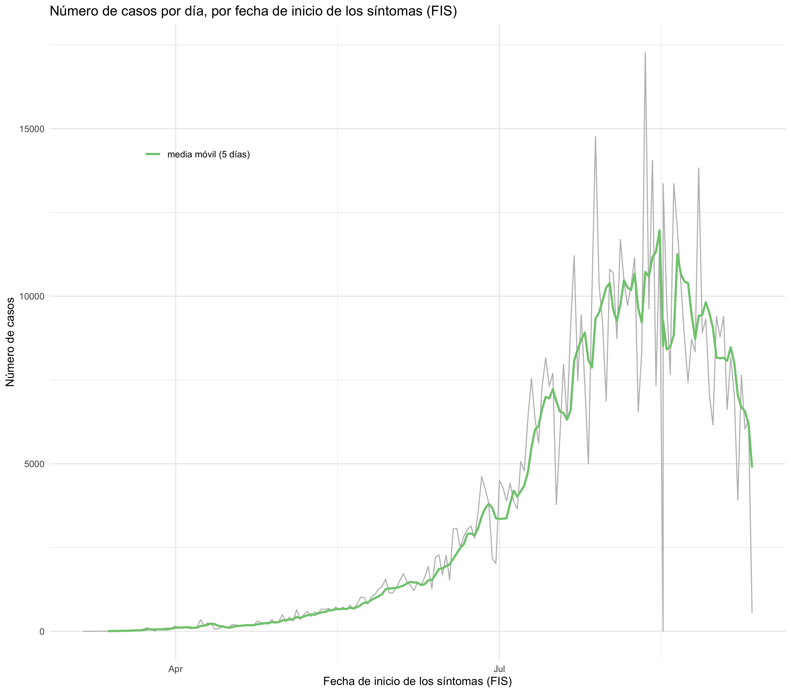

<!-- README.md is generated from README.Rmd. Please edit that file -->

<!-- badges: start -->

<!-- badges: end -->

# Datos de COVID-19 para Colombia por departamentos y municipios hasta 03/09/2020

# Número de casos por incio de los síntomas

# Corrección de atrasos por *nowcasting* bayesiano (Mc Gough *et al* 2020)

Para saber más sobre el análisis de corrección de atrasos de
notificación por *nowcasting* bayesiano, visite la página del
**Observatório COVID19-BR**
[https://covid19br.github.io](https://covid19.br.github.io), grupo
independiente de investigadores de diversas universidades de Brasil y
del mundo, que realiza análisis relativos al estado de la pandemia en
Brasil.

# Referencia

McGough, S. F. et al. (2020) ‘Nowcasting by Bayesian Smoothing: A
flexible, generalizable model for real-time epidemic tracking’, PLOS
Computational Biology, 16(4), p. e1007735. doi:
10.1371/journal.pcbi.1007735.
<https://journals.plos.org/ploscompbiol/article?id=10.1371/journal.pcbi.1007735>
